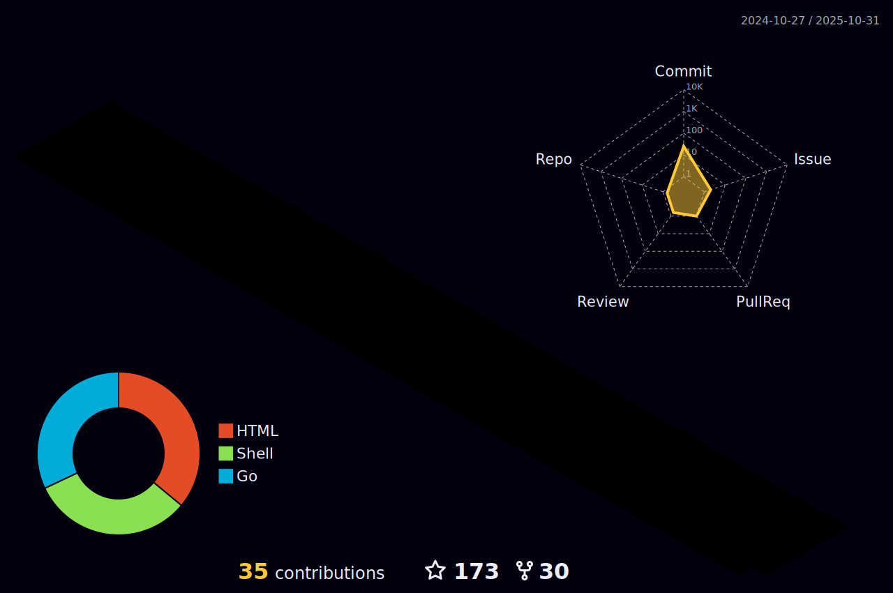

### Hi 👋, I'm 

<h3 align="center"><a href="https://hud0shnik.github.io/">
   </a>
</h3>

<h3>🔎 About me :</h3>

- 🔭 I’m currently working on ***[Vall-Halla-api](https://github.com/hud0shnik/vallhallaapi)***
- 🌱 I’m learning: **Backend, Linux, IT Security**
- 💬 Ask me about **[my Telegram bots](https://github.com/stars/hud0shnik/lists/my-bots)**
- 😍 I love green tea, Hawaiian pizza and 💙golang💙
- ⚡ Fun fact: Astronauts use linux because you can't open windows in space
- 📫 How to reach me: danila_egorov02@mail.ru
- 🍵 You may buy me a ***[tea](https://www.buymeacoffee.com/hud0shnik)***

<h3>✉️ Connect with me :</h3>
<p>
   <a href="https://t.me/hud0shnik" ></a>
   <a href="https://vk.com/hud0shnik" ></a> 
</p>

<h3>🛠 Languages and Tools :</h3>
<p>
   <!-- Vs Code -->
   <a href="https://github.com/search?q=user%3Ahud0shnik&type=repositories" >
   </a>
   <!-- Docker -->
   <a href="https://github.com/hud0shnik/golang-to-do" >
   </a>
   <!-- CSS -->
   <a href="https://github.com/hud0shnik/hud0shnik.github.io" > 
   </a>
   <!-- Arch -->
   <a href="https://github.com/hud0shnik?tab=repositories" > 
   </a>
   <!-- Postgresql -->
   <a href="https://github.com/hud0shnik/golang-to-do" >
   </a>
   <!-- Golang -->
   <a href="https://github.com/search?l=Go&q=user%3Ahud0shnik+language%3AGolang&type=Repositories" > 
   </a>
   <!-- Arduino -->
   <a href="https://github.com/hud0shnik/arduino"  > 
   </a>
   <!-- Qt -->
   <a href="https://github.com/hud0shnik/messenger" > 
   </a>
   <!-- Python -->
   <a href="https://github.com/search?l=Python&q=user%3Ahud0shnik&type=Repositories" > 
   </a>
   <!-- JavaScript -->
   <a href="https://github.com/hud0shnik/hud0shnik.github.io" > 
   </a>
   <!-- Html -->
   <a href="https://github.com/hud0shnik/hud0shnik.github.io" >
   </a>
   <!-- Ubuntu -->
   <a href="https://ubuntu.com/" >
   </a>
   <!-- GitLab -->
   <a href="https://gitlab.com/" >
   </a>
   <!-- Git -->
   <a href="https://github.com/search?q=user%3Ahud0shnik&type=repositories" > 
   </a>
   <!-- Ruby -->
   <a href="https://github.com/search?l=Ruby&q=user%3Ahud0shnik&type=Repositories" >
   </a>
   <!-- Visual Studio -->
   <a href="https://github.com/search?l=C%2B%2B&q=user%3Ahud0shnik&type=Repositories" >
   </a>
   <!-- Bash -->
   <a href="https://www.gnu.org/software/bash/">
   </a>
</p>


<h3>🔥 Statistics :</h3>

<!-- пока не работает

-->


<details>
   <summary> 📈 Contribution Graph </summary>
   <br/>
   
   
</details>

<details>
   <summary> 🕗 WakaTime </summary>
   </br>
   Total time coded since May 9 2022
   </br> 
   
   </br></br>

   <!--START_SECTION:waka-->
**I'm an Early 🐤** 

```text
🌞 Morning                723 commits         ⣿⣿⣿⣀⣀⣀⣀⣀⣀⣀⣀⣀⣀⣀⣀⣀⣀⣀⣀⣀⣀⣀⣀⣀⣀   13.94 % 
🌆 Daytime                2242 commits        ⣿⣿⣿⣿⣿⣿⣿⣿⣿⣿⣿⣀⣀⣀⣀⣀⣀⣀⣀⣀⣀⣀⣀⣀⣀   43.22 % 
🌃 Evening                1898 commits        ⣿⣿⣿⣿⣿⣿⣿⣿⣿⣀⣀⣀⣀⣀⣀⣀⣀⣀⣀⣀⣀⣀⣀⣀⣀   36.58 % 
🌙 Night                  325 commits         ⣿⣿⣀⣀⣀⣀⣀⣀⣀⣀⣀⣀⣀⣀⣀⣀⣀⣀⣀⣀⣀⣀⣀⣀⣀   06.26 % 
```
📅 **I'm Most Productive on Friday** 

```text
Monday                   721 commits         ⣿⣿⣿⣀⣀⣀⣀⣀⣀⣀⣀⣀⣀⣀⣀⣀⣀⣀⣀⣀⣀⣀⣀⣀⣀   13.90 % 
Tuesday                  744 commits         ⣿⣿⣿⣿⣀⣀⣀⣀⣀⣀⣀⣀⣀⣀⣀⣀⣀⣀⣀⣀⣀⣀⣀⣀⣀   14.34 % 
Wednesday                773 commits         ⣿⣿⣿⣿⣀⣀⣀⣀⣀⣀⣀⣀⣀⣀⣀⣀⣀⣀⣀⣀⣀⣀⣀⣀⣀   14.90 % 
Thursday                 623 commits         ⣿⣿⣿⣀⣀⣀⣀⣀⣀⣀⣀⣀⣀⣀⣀⣀⣀⣀⣀⣀⣀⣀⣀⣀⣀   12.01 % 
Friday                   783 commits         ⣿⣿⣿⣿⣀⣀⣀⣀⣀⣀⣀⣀⣀⣀⣀⣀⣀⣀⣀⣀⣀⣀⣀⣀⣀   15.09 % 
Saturday                 776 commits         ⣿⣿⣿⣿⣀⣀⣀⣀⣀⣀⣀⣀⣀⣀⣀⣀⣀⣀⣀⣀⣀⣀⣀⣀⣀   14.96 % 
Sunday                   768 commits         ⣿⣿⣿⣿⣀⣀⣀⣀⣀⣀⣀⣀⣀⣀⣀⣀⣀⣀⣀⣀⣀⣀⣀⣀⣀   14.80 % 
```


<!--END_SECTION:waka-->
</details>

<details>
   <summary> 🦾 Profile-3d-contrib </summary>
   <br/>
   
</details>
